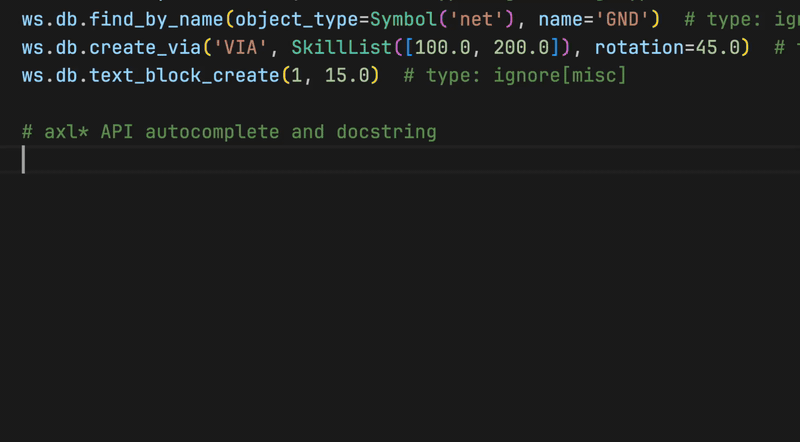

# Raw AXL access

The typed domain APIs cover the common cases. Everything else is available on
the raw workspace:

```python
ws = allegro.workspace  # or: pcb.raw from a Session
```

## Calling axl functions

All 792 documented `axl*` functions are reachable, grouped by prefix and
translated to snake_case:

```python
design = ws.axl.db.get_design()
via = ws.axl.db.create_via("VIA_DEFAULT", (100.0, 50.0))
```

*Skill equivalent:* `axlDBGetDesign()` and
`axlDBCreateVia("VIA_DEFAULT" 100:50)`

Keyword arguments in the SKILL documentation (`?rotation 45.0`) become Python
keyword arguments:

```python
ws.axl.db.create_via("VIA_DEFAULT", (100.0, 50.0), rotation=45.0)
```

The generated stubs ship with the package, so a PEP 561-aware IDE completes
every function and shows the Cadence reference documentation on hover:



!!! note

    Two lowercase APIs, `axlcreate` and `axldo`, are not valid attribute
    names. Call them through the function proxy instead:
    `ws['axlcreate'](...)` / `ws['axldo'](...)`.

!!! warning

    Raw calls bypass the transaction kernel. A raw write that fails halfway
    stays half-applied. Route writes through [`ws.transaction`](transactions.md)
    when you need atomicity, preview, or savepoints.

## SKILL values in Python

Some functions take quoted symbols, key arguments, or literal snippets. The
wrapper classes from `skillbridge` build them:

```python
from skillbridge import Symbol, Key, SkillCode, SkillList, SkillTuple

ws.axl.db.set_variable(Symbol('myvar'), 42)  # passes 'myvar
Key('width')  # ?width
SkillCode('println("hello")')  # sent verbatim
SkillList([1, 2, 3])  # (1 2 3)
SkillTuple((100.0, 50.0))  # 100.0:50.0
```

*Skill equivalent:* `'myvar`, `?width`, `println("hello")`, `(1 2 3)`,
`100.0:50.0`.

## Remote objects

Functions that return database objects give you `RemoteObject` handles. Their
SKILL properties are plain Python attributes:

```python
>>> design = ws.axl.db.get_design()
>>> design.b_box
[[0, 0], [14400, 9600]]
```

*Skill equivalent:* `design->b_box`

See [Remote objects](../reference/remote-objects.md) for attribute assignment,
`dir()` completion, and the lazy list types.
